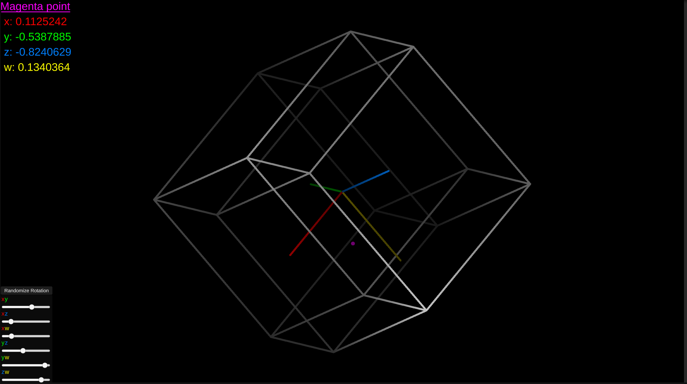

# 4D Projection Playground

This is the **Assets** folder of the Unity project. Tested with Unity 2021.3.20f1 Personal. Everything is inside SampleScene. To run this you shouldn't need anything other than TextMeshPro.

Check out the WebGL release on itch.io: https://ascyt.itch.io/4d-projection-playground

## What is this?

This is an orthographic projection of a 4-dimensional hypercube (also called a tesseract, which is basically a cube but in four instead of three dimensions) in 2D.

By introducing another spatial dimension, we are adding a new coordinate to the system, the w axis - instead of just having `(x, y, z)` we now have `(x, y, z, w)`. However, since our brains are designed to understand 3D and not 4D, it might be really difficult or even impossible for one to truly wrap their mind around this new dimension. 

What you see is a wireframe model of the tesseract. The darker the lines, the "farther away" that line is from the viewport - since to render the cube we have to hide two out of the four dimensions (z and w). In the center you can see the coordinates: x is red, y is green, z is blue, w is yellow. There is also a magenta point, which is at the position (0.5, 0.5, 0.5, 0.5) at the start.

It's possible to rotate the tesseract using the **interface at the bottom of the screen**. You can click on the "**Randomize Rotation**" button to get a random rotation, or you can manually play around with the six **planes of rotation** (in 4D it's not possible to rotate solely on axes - rotations are fundamentally two-dimensional, which isn't the case in 3D). It is also important to note that the shown axes rotate with the tesseract, and are only aligned with the true axes of the simulation at the start, when no rotation is applied.

It might be difficult to wrap your head around what is happening here - that is understandable. I honestly couldn't either. However, I am fascinated by the fact that the cube actually looks like it's spinning (in a weird way that is), instead of it looking like random lines transforming in random ways, and I think that's pretty cool. 

## How this works
The tesseract is just two cubes, each connected at all of their vertices, one with the `w` coordinate being `1`, the other with the `w` coordinate being `-1`. 

When the sliders are changed, the vertices get rotated and that gets projected onto the screen. The projection is very simple - we're merely cutting away the `z` and `w` coordinates, and leaving only the `x` and `y` coordinates, effectively projecting every point onto the `xy` origin plane. 

These points then get instantiated in a 2D plane in Unity, and LineRenderer objects connect these points to each other according to a lookup table. The brightness is determined by the otherwise discarded `(z, w)` Vector's magnitude (distance from the origin), the farther away, the darker the color. 

The main thing doing most of the fancy 4D lifting here are the [rotation matrices](https://math.stackexchange.com/questions/1402362/can-rotations-in-4d-be-given-an-explicit-matrix-form/3311905#3311905), effectively letting me rotate a 4D point around the origin in each of the rotational planes. 

## Why?

Because it's cool. For a good while I've had a pretty big fascination with 4D, and this small project is definitely not the end of it. 

I got tired of seeing a lot of *3D cutouts of 4D objects* and *4D projections that you can only rotate with your mouse which barely lets you spin it around*, and I wanted to try my hands on writing something like this myself.

This is almost certainly not my last project on 4D - I'm planning to make a simple game that uses 4D projections, preferably perspective projections, if I can figure out how to do that, that is. 